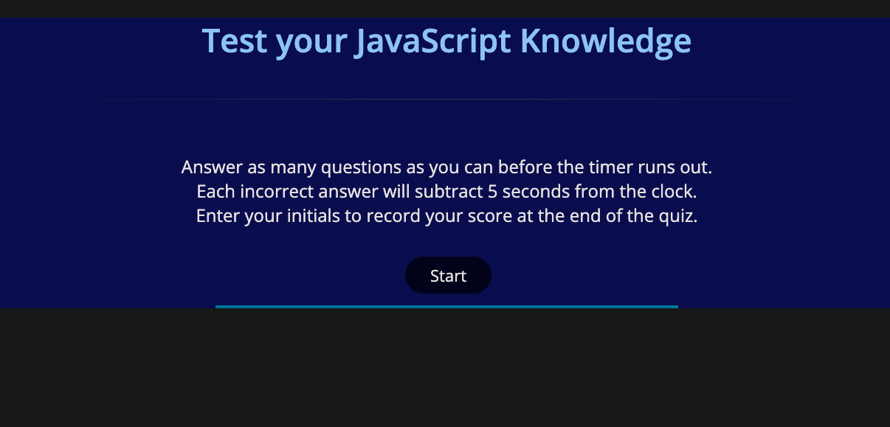
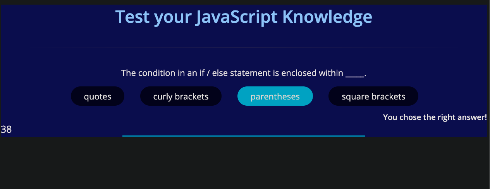
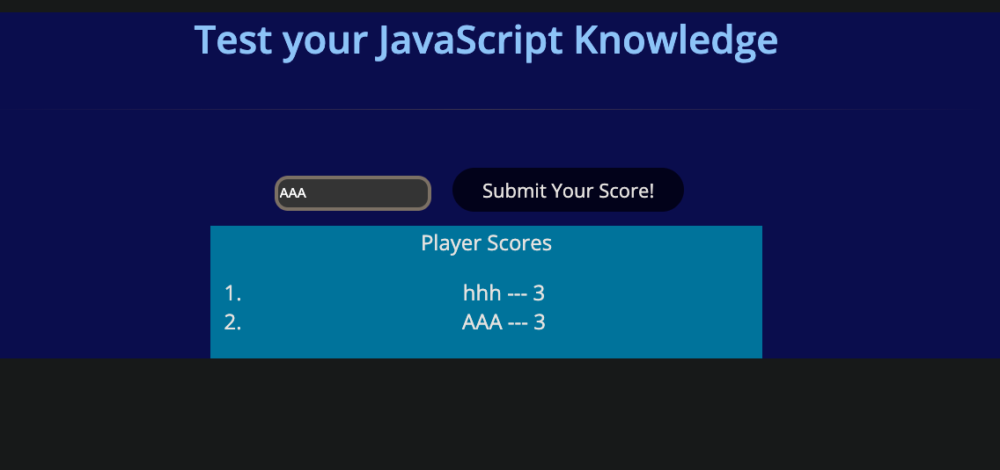

# JS-Code-Quiz

## Description

This is a coding quiz application using dynamically updated HTML, CSS and JavaScript, with a series of multiple choice questions for users to test their knowledge of JavaScript.

The quiz includes a timer for users to refer to, while answering the questions.  Users will be able to view their score in the browser upon completion of the quiz and timer.

---

### How to Use:

- Click on this  [Link to Deployed App](https://cheribc.github.io/JS-Code-Quiz/) 
  
- Click the start button
  

- Click on one of the answers to each question, located below the question

- The timer located in the far left bottom of the screen will show the number of seconds remaining in your quiz, and missed questions will remove 5 seconds from the remaining time

- When you have finished answering all of the questions, you will be prompted to enter your initials into the box, and your score will be displayed in a list of other scores

---

### Technology Used

 

- HTML
- CSS
- Javascript

---

#### Author

[Cheribc](https://github.com/cheribc)

---

#### License

[MIT](LICENSE)